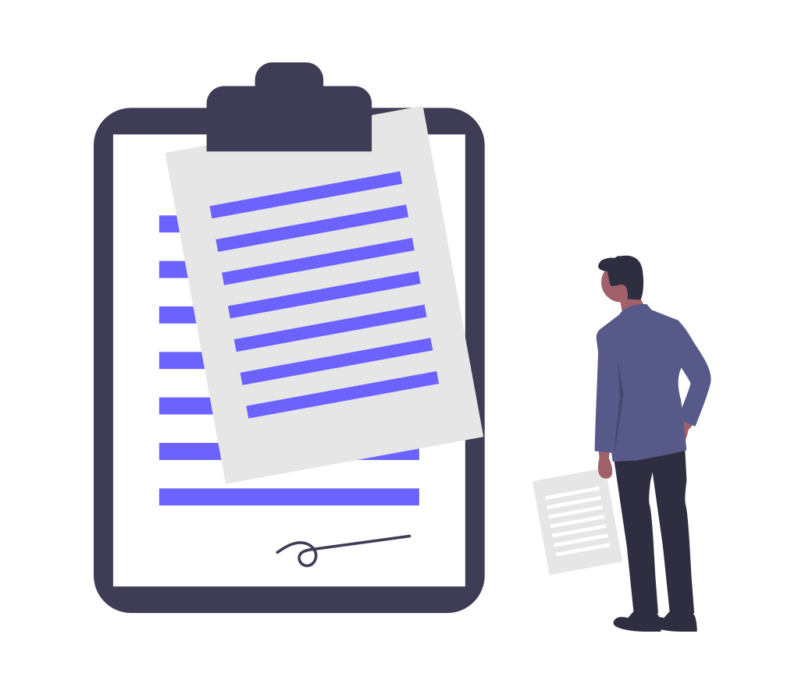

<h1 align="center"> Código de conducta </h1>  

          
      
        

    

En **Stuja** valoramos la participación de todos los miembros de la comunidad y queremos que todos los estudiantes tengan una experiencia agradable y satisfactoria. En consecuencia, se espera que todos los miembros muestren respeto y cortesía a otros miembros de la comunidad.

## Versión corta

Los miembros de Stuja se comprometen a mantener un entorno sin abusos para todo el mundo, sin importar sexo, identidad u orientación sexual, elección de software o sistema operativo, discapacidad, aspecto físico, edad, raza, nacionalidad, creencia religiosa, educación, gustos personales o ideales.

Este Código de Conducta cubre el comportamiento de todos los miembros de la comunidad Stuja en cualquier foro, lista de correo, sitio web, canal de IRC o Telegram, evento y reunión pública.

No toleramos el acoso a miembros de la comunidad bajo ningún concepto. Cualquier persona que viole este código de conducta puede ser sancionado o expulsado de estos espacios a discreción del equipo.

Si eres víctima de conductas abusivas, notas que otra persona está siendo acosada o tienes dudas, por favor [contacta con nosotros](https://forms.gle/4HhgNvhabrvG79Af8). 

## La versión un poco más larga

No toleramos el acoso a miembros de la comunidad bajo ningún concepto, por ejemplo:

- Comentarios ofensivos relacionados con sexo, identidad u orientación sexuales, elección de software o sistema operativo, discapacidad, aspecto físico, edad, raza, nacionalidad, creencias religiosas, educación, gustos personales o ideales.
- Comentarios no deseados acerca de las opciones y prácticas de estilo de vida de una persona, incluyendo aquellos relacionados con alimentos, salud, crianza de los hijos, drogas y empleo.
- El contacto físico y el contacto físico simulado sin consentimiento o después de una solicitud de alto.
- Amenazas de violencia, incluyendo Incitación a la violencia hacia cualquier individuo, incluyendo alentar a una persona para que se suicide o se autolastime.
- Intimidación deliberada, como Acoso o bullying.
- Hostigamiento con fotografía o grabación, incluida la actividad en línea con fines de acoso.
- Interrumpir a los demás cuando están dando su punto de vista durante una discusión (“mansplaining”).
- Comportamientos sexuales no deseados.
- Patrón de contacto social inapropiado, como solicitar / asumir niveles inadecuados de intimidad con otros.
- Continuar la comunicación uno-a-uno después de las solicitudes de alto.
- Publicar elementos de comunicación privada sin conocimiento de la otra persona, como correos, mensajes de texto, etc..

## Informa

Si eres acosado por un miembro de Stuja, notas que alguien más está siendo acosado o tienes alguna otra preocupación, por favor [contacta con nosotros](https://forms.gle/4HhgNvhabrvG79Af8). Responderemos tan pronto como podamos.

Respetaremos las solicitudes de confidencialidad con el propósito de proteger a las víctimas de abuso y no nombraremos víctimas de acoso sin su consentimiento.
